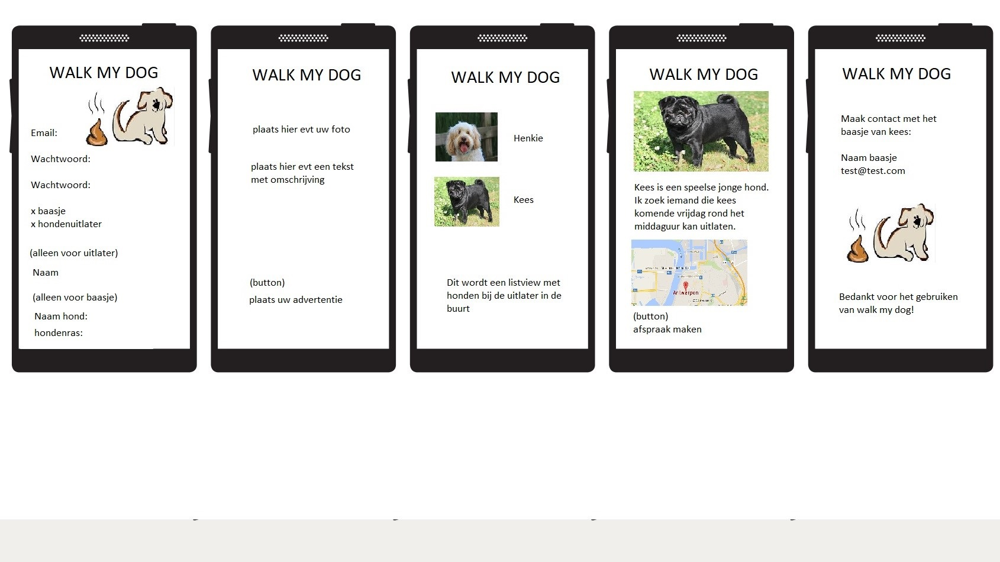

# Project proposal

## Problem
Honden baasjes hebben vaak het probleem dat ze geen tijd hebben om de hond uit te laten. 
Gelukkig zijn er ook mensen die geen hond hebben om bijvoorbeeld de reden dat het veel geld kost of
omdat er iemand in huis een allergie heeft.

## Solution
#### Summary
Met deze app wil ik deze mensen aan elkaar koppelen.
Zo kan iemand zonder hond toch even een loopje maken en hoeft het baasje zijn schema niet aan te passen om de hond uit te laten.
Je kan een account aanmaken en daarbij aangeven of je een hondenbaasje bent of een hond wil uitlaten. Vervolgens kunnen de baasjes advertenties plaatsen met een foto van hun hond met een beschrijving. Als je geinteresseerd bent in een advertantie kan je vragen om de email van het baasje en elkaar mailen om afspraken te maken.
Als ik tijd over heb wil ik dat de uitlaters ook beoordeeld kunnen worden. Zo kan je zien of iemand betrouwbaar is.

#### Visual sketch

#### Main features
* **Account aanmaken/inloggen als baasje of uitlater.**
* **Als baasje een advertentie kunnen plaatsen.**
* **Als uitlater advertenties zien van anderen inclusief locatie.**
* **Alleen advertenties in de buurt zien.**
* **Contactgegevens zien van gekozen advertentie.**

## Prerequisites
#### Datasource
API voor google maps om locatie op te slaan van gebruiker en te laten zien aan de uitlater.
Als ik er tijd voor heb, zorg ik dat ook de afstand tussen de gebruikers gebruikt wordt om de advertenties te ranken.

#### External components
Gebruik van firebase om gegevens van gebruikers bij te houden.

#### Similar
Dog Walker Online.
Is in het engels en niet gebruiksvriendelijk. Wordt ook slecht beoordeeld door gebruikers.
Deze app werkt ook met betalingen.
Zo zijn er nog meer apps die het beschouwen als een bijbaantje. Deze apps zijn dan ook erg ingewikkeld en moeilijk te gebruiken.

#### Hardest parts
Het instellen dat een foto toegevoegd kan worden aan een advertentie.
Het gebruiken van informatie uit de api van google maps.

