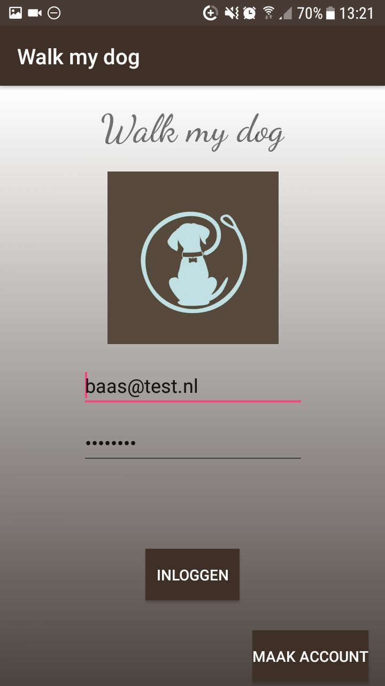
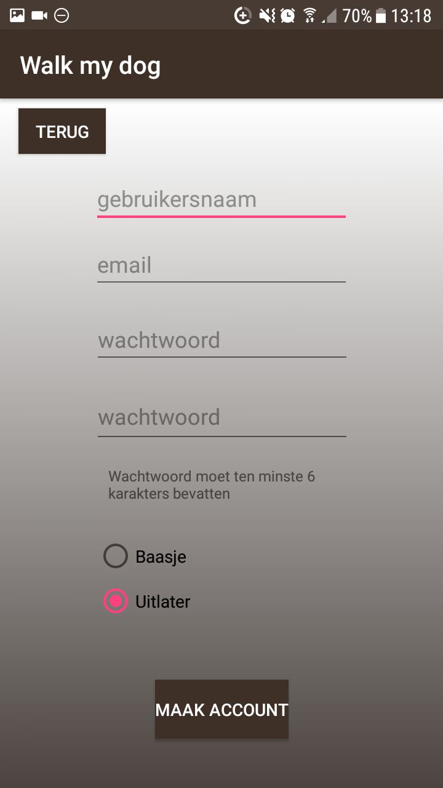
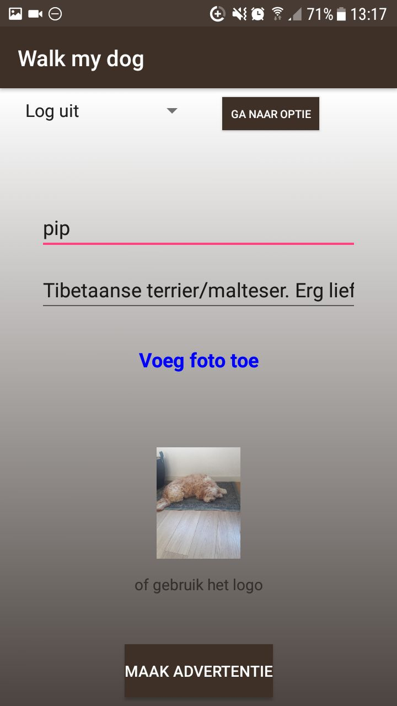
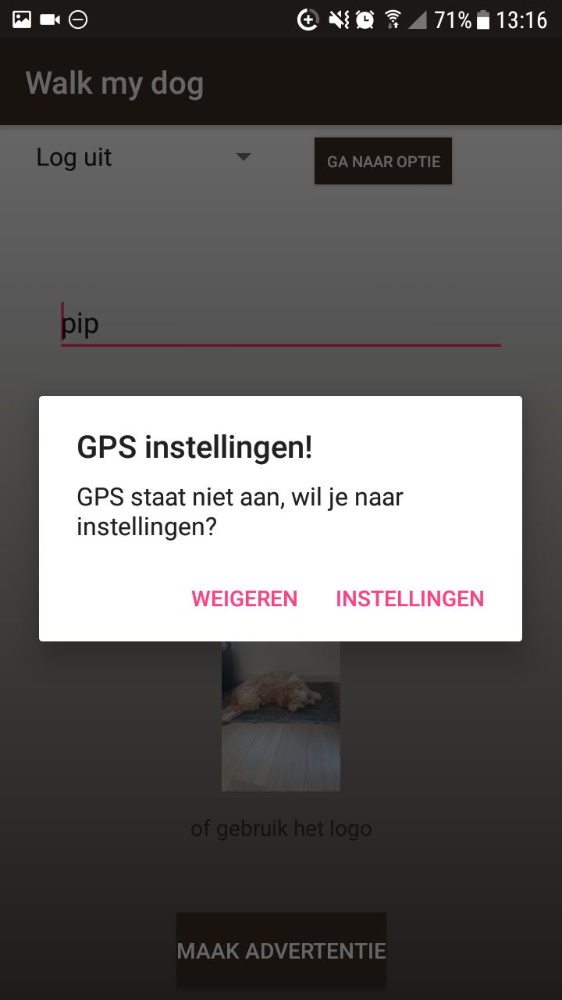
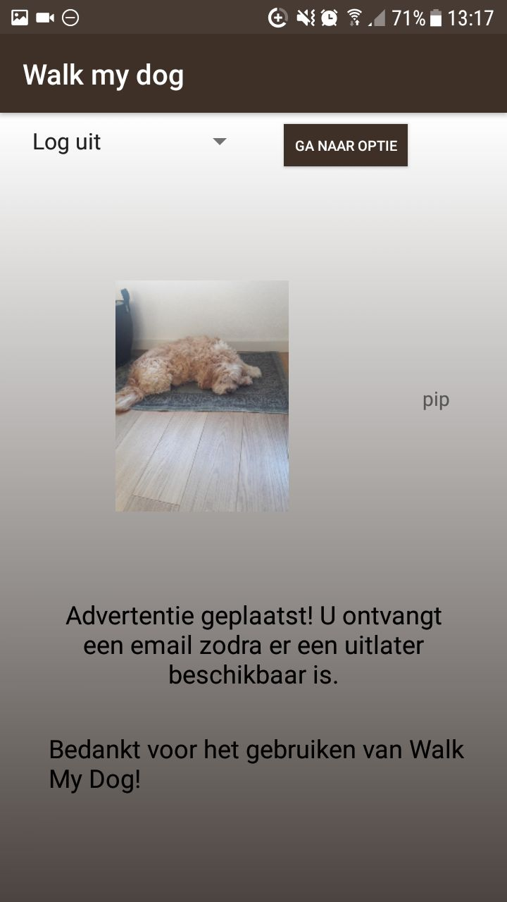
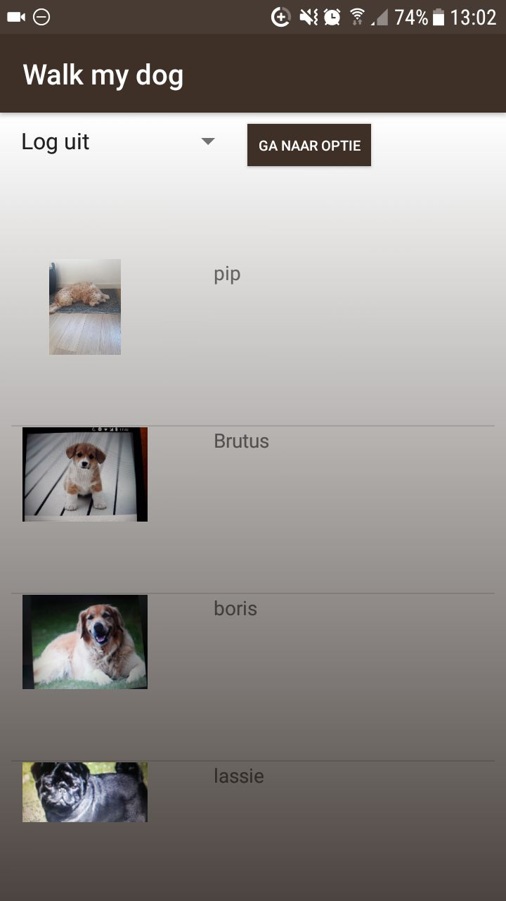
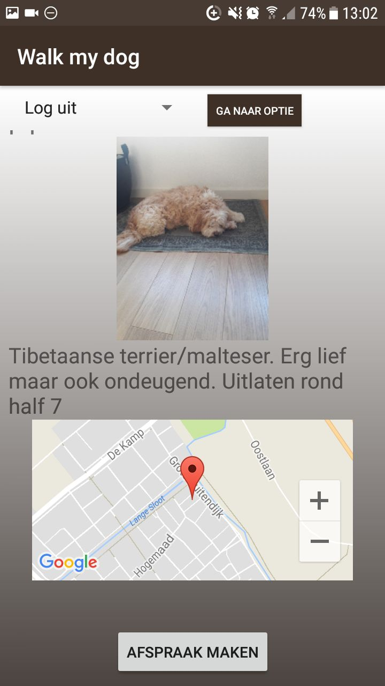
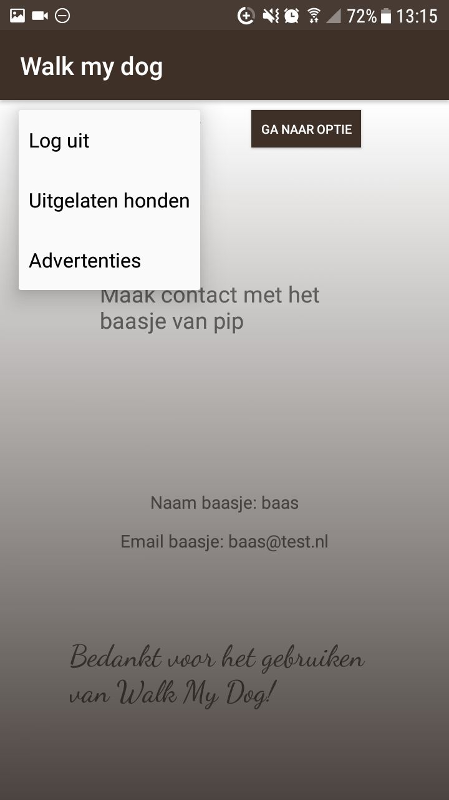
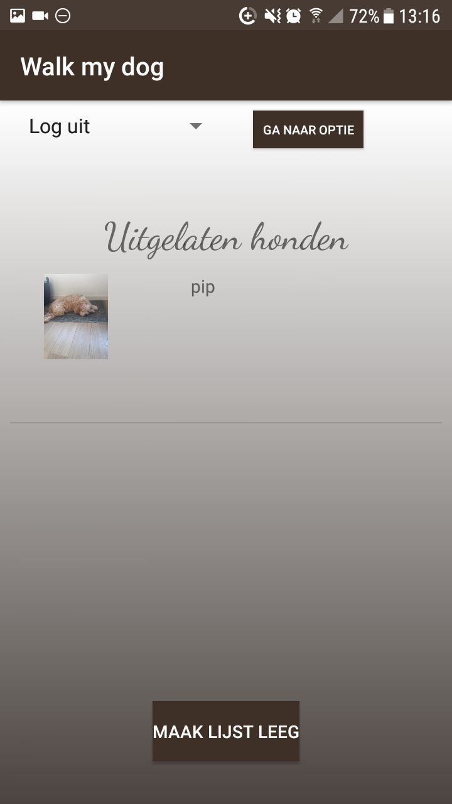

## Uitleg:
Honden baasjes hebben vaak het probleem dat ze geen tijd hebben om de hond uit te laten. Gelukkig zijn er ook mensen die geen hond hebben om bijvoorbeeld de reden dat het veel geld kost of omdat er iemand in huis een allergie heeft. Met deze app wil ik deze mensen aan elkaar koppelen. Zo kan iemand zonder hond toch even een loopje maken en hoeft het baasje zijn schema niet aan te passen om de hond uit te laten.

Je kan een account aanmaken en daarbij aangeven of je een hondenbaasje bent of een hond wil uitlaten. Vervolgens kunnen de baasjes advertenties plaatsen met een foto van hun hond met een beschrijving. Als uitlater zie je een overzicht van alle advertenties. Door op een advertentie te klikken zie je meer informatie. Als je geinteresseerd bent in een advertantie kan je vragen om de email van het baasje en elkaar mailen om afspraken te maken. Als uitlater wordt er ook een lijst met honden begehouden die je al uitgelaten heb. Zo kan je makkelijk de vorrige afspraken terug vinden.

Deze app is alleen beschikbaar in portrait modus. De landscape modus is niet meegenomen omdat dit geen toegevoegde waarde heeft bij deze app.

#### Screenshots:

## Een aantal interessante punten:
In deze app wordt gps gebruikt om de locatie van een baasje te verkrijgen.
Vervolgens wordt de API voor google maps gebruikt om de locatie te laten zien aan de uitlater.
De app maakt ook gebruik van de camera van de gebruiker (baasje).
Verder wordt er gebruik gemaakt van firebase als database om alle gegevens van de gebruikers op te slaan.
