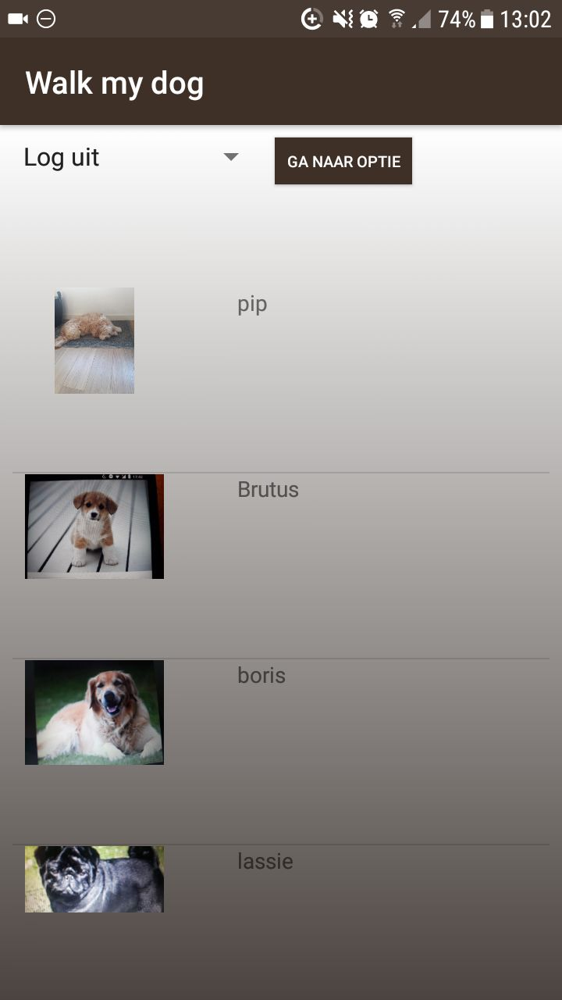

## Korte uitleg:
Honden baasjes hebben vaak het probleem dat ze geen tijd hebben om de hond uit te laten. 
Gelukkig zijn er ook mensen die geen hond hebben om bijvoorbeeld de reden dat het veel geld kost of
omdat er iemand in huis een allergie heeft.
Met deze app wil ik deze mensen aan elkaar koppelen.
Je kan een account aanmaken en daarbij aangeven of je een hondenbaasje bent of een hond wil uitlaten. Vervolgens kunnen de baasjes 
advertenties plaatsen met een foto van hun hond met een beschrijving. Als je geinteresseerd bent in een advertantie kan je vragen 
om de email van het baasje en elkaar mailen om afspraken te maken.

Screenshot of an activity:

## Belangrijkste functies van de app:
Deze app heeft de volgende functies:
* Account aanmaken/inloggen als baasje of uitlater.
* Als baasje een advertentie kunnen plaatsen.
* De gebruiker (baasje) kan een foto kan maken in de app.
* Als uitlater advertenties zien van anderen inclusief locatie.
* Uitlaters zien een lijst met favorieten (uitgelaten honden)
* Contactgegevens zien van gekozen advertentie.

## Activities met functies:
In de meeste activities (alleen MainActivity en RegisterActivity niet) is ook bovenin een spinner geplaatst, zodat de gebruiker makkelijk kan navigeren tussen verschillende activities.gg

#### MainActivity:
De MainActivity is de login pagina. 
Hierin kan je email en wachtwoord invullen en wordt de validatie gecheckt met firebase.
Vanaf hier kan je naar RegisterActivity door de register knop.
Met de log in knop kan je naar AdvertActivity of ChooseActivity gestuurd worden, afhankelijk van het soort gebruiker.
Hierbij gebruik ik de variabele "user type" uit de class User in de database.

#### RegisterActivity: 
RegisterActivity is de registreer pagina.
Hierin vul je een email in en twee keer een wachtwoord.
De opgegeven gegevens worden in firebase authentication gezet.
Bij registratie geef je ook aan of je een baasje of uitlater bent en geef je een naam op.
De gebruiker geeft een naam op en zet de gegevens in class User.
Deze class wordt in de databse gezet onder het kopje "users" met als naam de user id.
Met de aanmeld knop kan je naar AdvertActivity of ChooseActivity gestuurd worden, afhankelijk van het soort gebruiker.

#### ChooseActivity: 
In deze activity zie je een lijst alle uitstaande advertenties van honden (foto met naam).
Deze data haal ik uit de database uit het kopje "dogs".
Op deze honden kan je klikken om naar DogActivity te gaan om meer informatie te zien over een hond.
Hierbij wordt het id van het baasje van de hond meegegeven.

#### DogActivity:
Hierin is een foto met beschrijving van de hond en de naam van de hond te zien in een scrollview.

Ook de locatie van het baasje van de hond wordt weergeven in een map (indien beschikbaar).
De locatie haal ik als een latitude en longitude uit de database.
Hierbij gebruik ik de api-key van google om de map te maken.

Als de gebruiker een afspraak wil maken, gaat de gebruiker via een knop naar ContactActivity.
Bij het maken van de afspraak wordt ook de hond toegevoegd aan lijst met uitgelaten honden in database.

#### ContactActivity: 
Deze activity geeft simpelweg de gegevens van het baasje van de hond, zodat een afspraak gemaakt kan worden.
Hierop is de naam en email te zien van het baasje van de gekozen hond.
Deze informatie is uit de database gehaald door onder het kopje "users" bij het id van het baasje de class User op te vragen die deze informatie bevat.

#### OverviewActivity:
De OverviewActivity bestaat uit een lijst van honden foto's met namen welke al zijn uitgelaten.
Deze komen uit de favorites list van de user onder het kopje "users" in de database.

#### AdvertActivity: 
In deze activity is er de mogelijkheid om advertentie te plaatsen voor baasje.
Als er al een advertentie uit staat, zal deze data als default in de activity al klaar staan.
Dit wordt gecheckt door middel van de boolean "advert state" uit de class User.

Bij het openen van deze activity wordt (als dit nog niet eerder gedaan is of deze toestemming al gegeven is) gevraagd om toestemming voor locatie en het aanzetten van de gps. Deze wordt dan ook meteen opgevraagd.

Er is ook de mogelijkheid om een foto te maken. Ook hiervoor wordt toestemming gevraagd (als deze niet al gegeven is).
Bij de keuze om geen foto te maken wordt het logo van de app gebruikt. 
Bij de keuze om wel een foto te maken zal deze foto alleen in firebase opgeslagen worden door middel van base 64 (het omzetten van de foto naar een string). Hierbij wordt in de app genavigeerd naar een camera scherm waar de foto gemaakt kan worden.
Vervolgens wordt er gevraagd de naam en een omschrijving in te vullen van de hond, waarin ook enkele details aangegeven kunnen worden, zoals de uitlaattijden. 

Deze data wordt opgeslagen in een class Dog, die vervolgens geplaatst wordt in de database onder het kopje "dogs" bij het id van het baasje.
Bij het maken van de advertentie wordt deze in de database gezet en wordt de gebruiker naar BevestigActivity gestuurd. 

#### ConfirmActivity:
Deze activity geeft een bevestigend bericht dat advertentie is geplaatst.

## Classes:
#### User:
Deze class bestaat uit informatie over de gebruiker.
De infromatie die erin staat:
* String userType: Kan waarde "walker" of waarde "owner" hebben.
* String name: Wordt uit de input van de user gehaald bij het registreren.
* String email: Wordt uit de input van de user gehaald bij het registreren.
* Boolean advertState: Staat default op false en kan alleen bij een baasje op true worden gezet bij het aanmaken van een advertentie.
* ArrayList<Dog> favorites: Staat default op null en kan alleen bij een uitlater aangemaakt/aangevuld worden op het moment dat een afspraak gemaakt wordt.
  
#### Dog:
Deze class bevat informatie over de advertentie/hond van de gebruiker (baasje).
De informatie die erin staat:
* String name: Wordt uit de input van de user gehaald bij het aanmaken van de advertentie.
* String description: Wordt uit de input van de user gehaald bij het aanmaken van de advertentie.
* String photo: Wordt uit de input van de user gehaald bij het aanmaken van de advertentie. De foto wordt omgezet naar een string door middel van base 64.
* Double lat: Staat default op 0 en wordt uit de aanvraag van locatie gehaald indien locatie beschikbaar.
* Double lon: Staat default op 0 en wordt uit de aanvraag van locatie gehaald indien locatie beschikbaar.
* String id: Id van huidige gebruiker (baasje van de hond) wordt opgevraagd bij het openen van de activity
  

## Moeilijkheden/Keuzes:
De moeilijkheid in deze app zit o.a. in het gebruiken van de camera met het opslaan van de foto in firebase. Uiteindelijk heb ik ervoor gekozen om base 64 te gebruiken voor het omzetten van de foto in plaats van firebase storage te gebruiken. Dit omdat het een veel simpelere code oplevert.

Ook het opvragen van de locatie en het zetten van de locatie in een map is lastig. Ik heb er gaandeweg pas voor gekozen om de locatie van gps op te vragen (huidige locatie) in plaats van dat de gebruiker zelf een locatie kan kiezen. Dit omdat het teveel werk was en ik het meer als extra functie heb beschouwd die eventueel later nog kon worden gedaan.
Met het verkrijgen van de locatie heb ik wel veel problemen gehad, dit kostte mij veel tijd (3 dagen). Tussendoor heb ik wel nog kleine dingen kunnen doen, dus dit was gelukkig geen verloren tijd.

Het gebruik van firebase is steeds veranderd. In eerste instantie zag de structuur er anders uit, maar ik wilde het efficienter maken, dus heb ik deze tussendoor veranderd. Dit maakte mijn code overzichtelijker.

Ik heb ook nog wat extra dingen toegevoegd omdat ik daar genoeg tijd voor had. Zo heb ik een dialog en een popup voor toestemmingen erin gezet voor locatie en camera. Dit heb ik tussendoor al gedaan, aangezien ik goed op schema lag.

Aan het eind heb ik nog geprobeerd de eigen locatie van de uitlater, die een advertentie bekijkt, erin te verwerken. Dit lukte mij niet in een korte tijd, dus heb ik besloten deze functie van de app te laten vallen en mij te concentreren op o.a. het opschonen van de code.
